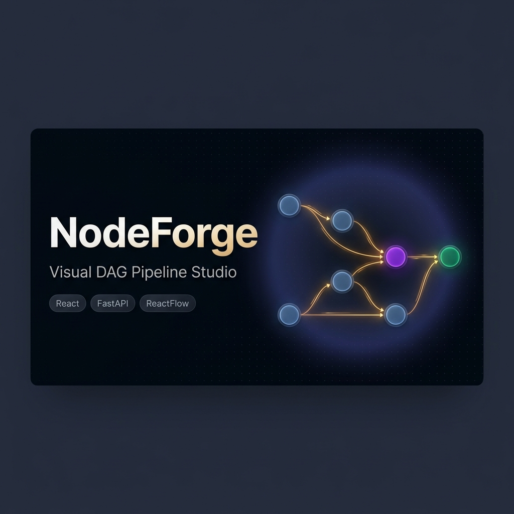

<div align="center">



# ⚡ NodeForge

### *Visual DAG Pipeline Orchestration Studio*

**Build, connect, and validate intelligent data pipelines through a drag-and-drop canvas — powered by a graph-theory backend that catches cycles before execution.**

[](https://react.dev/)
[](https://reactflow.dev/)
[](https://fastapi.tiangolo.com/)
[](https://zustand-demo.pmnd.rs/)
[](https://python.org/)

> *Drag. Connect. Validate. Execute.*

</div>

---

## 🧠 What Is NodeForge?

**NodeForge** is a full-stack visual pipeline editor — a developer-friendly, low-code platform where you construct AI and data processing workflows by wiring nodes on an infinite canvas. The backend validates your graph in real-time using graph algorithms, guaranteeing whether your pipeline is a valid **Directed Acyclic Graph (DAG)** before execution.

The architecture is built around four primary engineering pillars:

| # | Architecture Pillar | Core Technical Concept |
|---|---|---|
| 1 | **Node Abstraction System** | Component architecture, DRY principle, Config-driven UI |
| 2 | **Unified Design System** | CSS custom properties, design tokens, micro-animations |
| 3 | **Dynamic Text Node Logic** | Regex parsing, React state derivation, live ReactFlow handles |
| 4 | **Full-Stack Backend Integration** | REST API, Graph Theory (Kahn's Algorithm), CORS, Pydantic |

---

## ✨ Feature Highlights

- 🎨 **9 Draggable Node Types** — Input, Output, LLM, Text, API, Math, Filter, Note, Delay
- 🏗️ **Config-Driven `BaseNode` Architecture** — Add a new node in ~8 lines of declarative config
- 📐 **Smart Text Node** — Auto-resizing textarea that parses `{{variable}}` template literals into live connection handles dynamically
- ✅ **Pipeline DAG Validation** — FastAPI backend uses **Kahn's Algorithm** to detect cycles in O(V+E) time complexity
- 🔄 **50-Step Undo / Redo** — Full history state managed via Zustand
- 💾 **Auto-Persist to `localStorage`** — Your pipeline canvas survives browser page refresh
- 🧪 **Simulated Local Execution** — Step-by-step topological walkthrough directly in UI
- 🚫 **Self-Loop & Duplicate Edge Guard** — Connection validation layer prevents invalid links
- 🔍 **Searchable Node Palette** — Quick filtering of node types in the toolbar
- ⌨️ **Keyboard Shortcuts** — `Backspace`/`Delete` for instant node removal
- 🛡️ **Per-Node `ErrorBoundary`** — Isolated rendering boundaries keep the canvas stable

---

## 🗂️ Project Structure

```
NodeForge/
├── frontend/                     # React application
│   └── src/
│       ├── nodes/
│       │   ├── BaseNode.js       ← The core abstraction layer
│       │   ├── BaseNode.css      ← Shared node card styles & design tokens
│       │   ├── textNode.js       ← Dynamic handles via regex variable extraction
│       │   ├── llmNode.js        ← Declarative config wrapper
│       │   ├── apiNode.js        ← Declarative config wrapper
│       │   ├── mathNode.js       ← Declarative config wrapper
│       │   ├── filterNode.js     ← Declarative config wrapper
│       │   ├── noteNode.js       ← Declarative config wrapper
│       │   ├── delayNode.js      ← Declarative config wrapper
│       │   ├── inputNode.js      ← Input node
│       │   ├── outputNode.js     ← Output node
│       │   └── nodeDefaults.js   ← Single source of truth for node defaults
│       ├── store.js              ← Zustand store (state, undo/redo, persistence)
│       ├── ui.js                 ← ReactFlow canvas & drag-drop wiring
│       ├── toolbar.js            ← Searchable node library palette
│       ├── submit.js             ← API integration & DAG validation modal
│       ├── CanvasActions.js      ← Canvas controls (undo, redo, clear)
│       ├── draggableNode.js      ← Drag-source chip component
│       ├── NodeErrorBoundary.js  ← Per-node crash isolation boundary
│       ├── execution/
│       │   └── runPipeline.js    ← Local topological simulation engine
│       └── index.css             ← Global design system (CSS variables)
└── backend/                      # FastAPI Python backend
    ├── main.py                   ← FastAPI server & Kahn's DAG algorithm
    ├── test_main.py              ← Pytest test suite
    └── requirements.txt          ← Python dependencies
```

---

## 🚀 Getting Started

### Prerequisites

| Tool | Version |
|------|---------|
| Node.js | ≥ 16 |
| npm | ≥ 8 |
| Python | ≥ 3.8 |

### 1. Start the Backend

```bash
cd backend

# Create a virtual environment (recommended)
python -m venv .venv

# Activate virtual environment
# Windows:
.venv\Scripts\activate
# macOS/Linux:
source .venv/bin/activate

# Install dependencies
pip install -r requirements.txt

# Start FastAPI dev server
uvicorn main:app --reload --port 8000
```

> The API runs live at `http://localhost:8000`  
> Interactive Swagger docs available at `http://localhost:8000/docs`

### 2. Start the Frontend

```bash
cd frontend

# Install dependencies
npm install

# Start React dev server
npm start
```

> Open [http://localhost:3000](http://localhost:3000) to start creating visual pipelines!

---

## 🏗️ Architecture Deep Dive

### 1 — The `BaseNode` Abstraction (Config-Driven Components)

Instead of duplicating boilerplate across individual node components (handles, CSS card containers, field change handlers), a declarative config-driven abstraction is used:

```js
// Declarative node configuration
export const LLMNode = (props) => (
  <BaseNode
    {...props}
    title="LLM"
    category="llm"
    fields={[
      { key: 'model',       label: 'Model',       type: 'select', default: 'gpt-4o',
        options: ['gpt-4o', 'gpt-4o-mini', 'claude-opus', 'claude-sonnet'] },
      { key: 'temperature', label: 'Temperature', type: 'text',   default: '0.7' },
    ]}
    handles={{ inputs: ['system', 'prompt'], outputs: ['response'] }}
  />
);
```

`BaseNode` takes this config and:
- Renders the styled card container with category-specific color accents
- Dynamically maps fields to `<input>`, `<select>`, or `<textarea>` controls
- Automatically updates Zustand global state on change
- Spaces handles evenly along the node edges using `((i + 1) / (n + 1)) * 100%`

---

### 2 — Dynamic Text Node (Live Template Variable Parsing)

When typing `{{variableName}}` inside a Text Node, input handles are created dynamically on the left side of the node in real-time.

```js
// Regex matching valid JavaScript identifiers inside double braces
const VAR_RE = /\{\{\s*([a-zA-Z_$][a-zA-Z0-9_$]*)\s*\}\}/g;

const extractVariables = (text) => {
  const vars = new Set();
  let m;
  while ((m = VAR_RE.exec(text)) !== null) vars.add(m[1]);
  return [...vars];
};
```

When a variable tag is removed, the corresponding handle is removed and dangling connected edges are automatically cleaned up in the state store.

---

### 3 — Graph Validation (Kahn's Topological Sort Algorithm)

The backend endpoint `POST /pipelines/parse` calculates whether the canvas graph is a valid Directed Acyclic Graph (DAG) using Kahn's algorithm in $O(V + E)$ time complexity:

```python
def is_dag(nodes: List[Node], edges: List[Edge]) -> bool:
    ids = {n.id for n in nodes}
    graph = defaultdict(list)
    indegree = {nid: 0 for nid in ids}

    for e in edges:
        if e.source in ids and e.target in ids:
            graph[e.source].append(e.target)
            indegree[e.target] += 1

    queue = deque([nid for nid in ids if indegree[nid] == 0])
    visited = 0

    while queue:
        cur = queue.popleft()
        visited += 1
        for nxt in graph[cur]:
            indegree[nxt] -= 1
            if indegree[nxt] == 0:
                queue.append(nxt)

    return visited == len(ids)
```

---

## 🧪 Running Tests

```bash
cd backend
pytest test_main.py -v
```

The test suite validates:
- `GET /` health check
- Linear DAG evaluation (`is_dag: true`)
- Cyclic graph evaluation (`is_dag: false`)
- Pipeline node & edge count computation

---

## 🛠️ Tech Stack

| Layer | Technology |
|---|---|
| **Frontend Framework** | React 18 |
| **Canvas & Graph UI** | ReactFlow 11 |
| **State Management** | Zustand 4 |
| **Backend Framework** | FastAPI |
| **Data Validation** | Pydantic v2 |
| **ASGI Server** | Uvicorn |
| **Testing** | Pytest + HTTPX |
| **Styling** | Vanilla CSS + Design System Tokens |

---

## 👤 Author

**Saransh Gupta**  
[GitHub Profile](https://github.com/Saranshg14) | [LinkedIn](https://www.linkedin.com/in/saransh-gupta-2a9383219/)

---

## 📄 License

This project is licensed under the MIT License.
